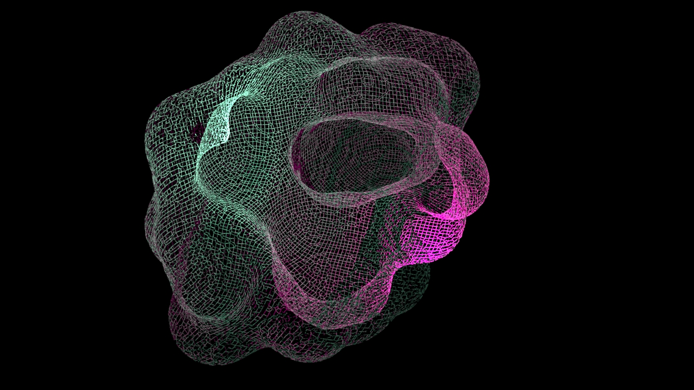
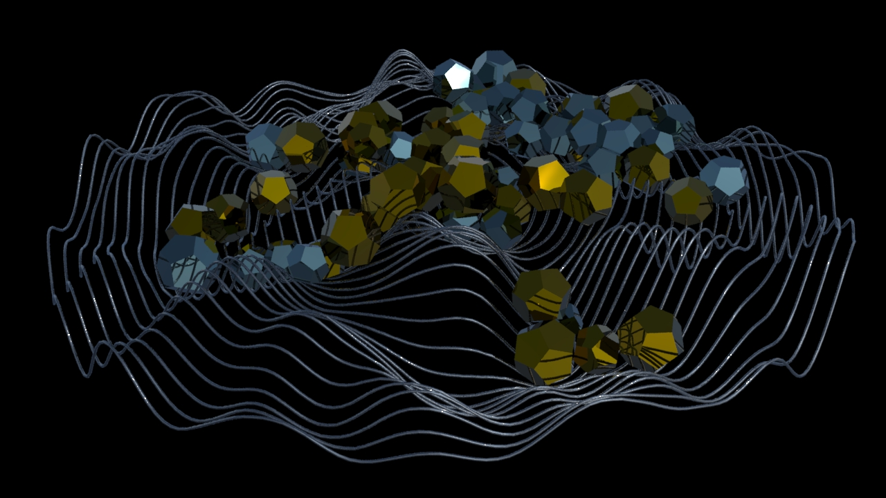
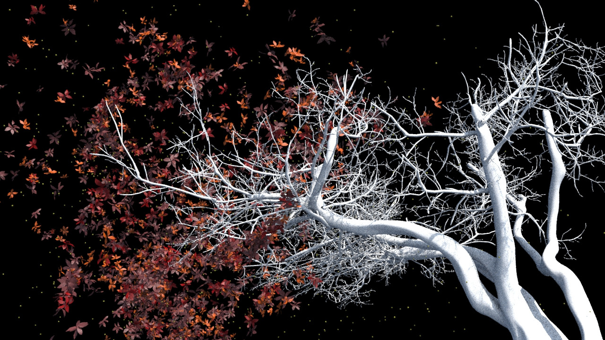
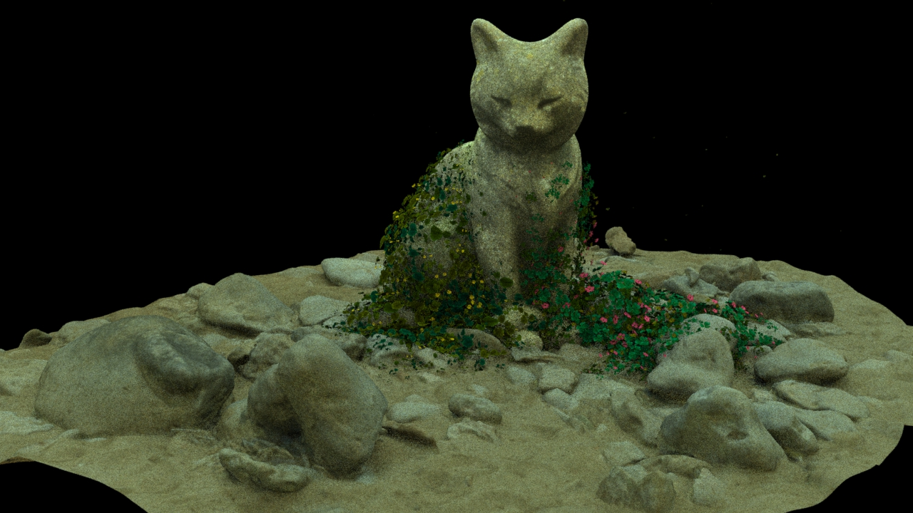
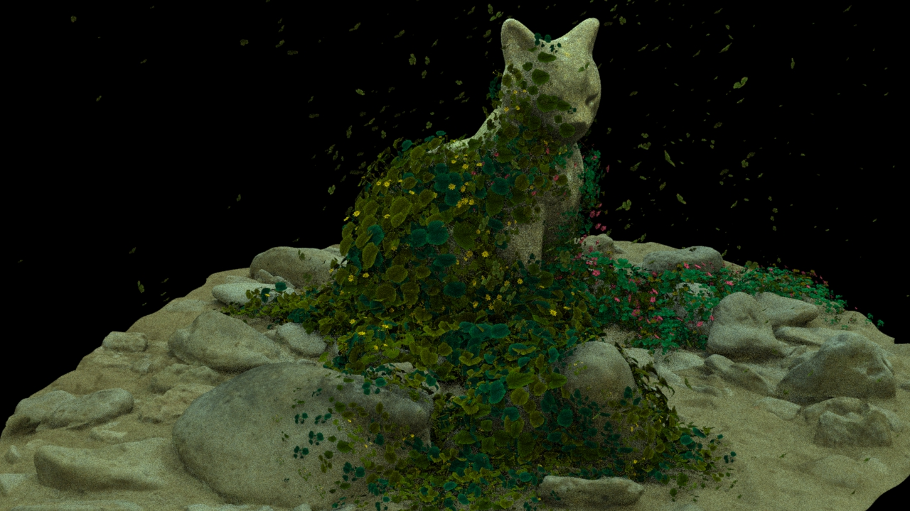
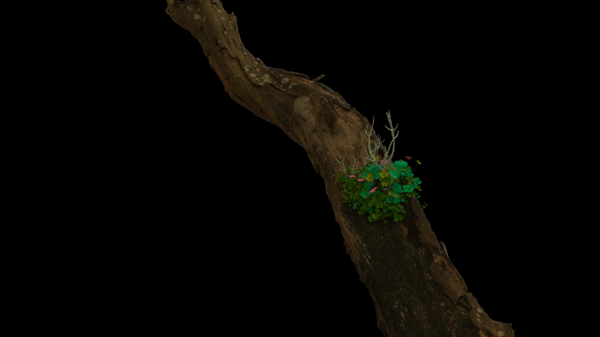
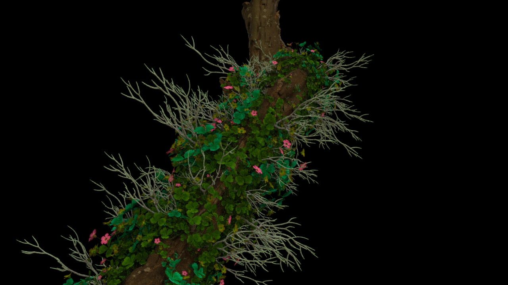
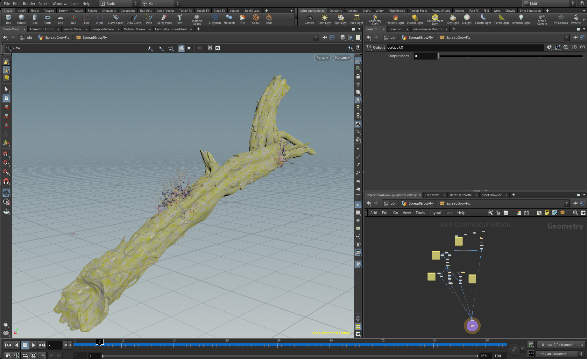
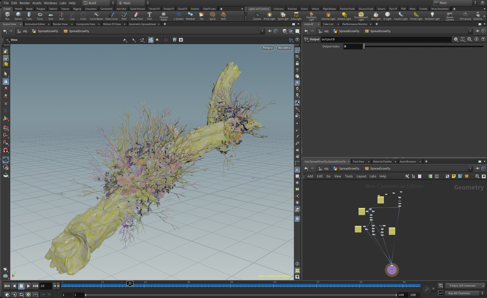
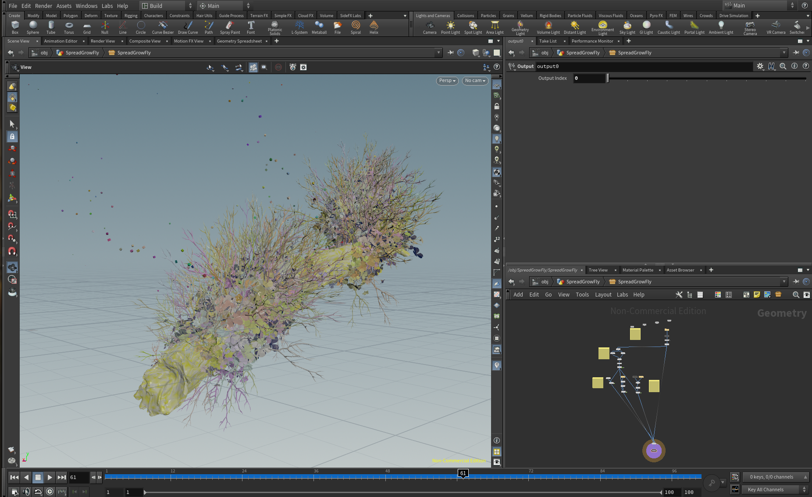

# Houdini Animation

Various animation I did in Houdini. Each folder contains Houdini source project and gallery.

## `Morph/`

Houdini 19.5.716 py3

View more on Artstation:
https://www.artstation.com/artwork/w0noNY

## `IsolineMovement/`

Houdini 19.5.716 py3

View more on Artstation:
https://www.artstation.com/artwork/qeweDe

## `TreeWind/`

Houdini 19.5.716 py3

View more on Artstation:
https://www.artstation.com/lovro

## `SpreadGrowth/`

Tech:
* Pyro spread
* VEX scaling, rotating
* GLTF instancing

Animation: https://www.artstation.com/artwork/Al89K5

Animation: https://www.artstation.com/artwork/XgZB2w

