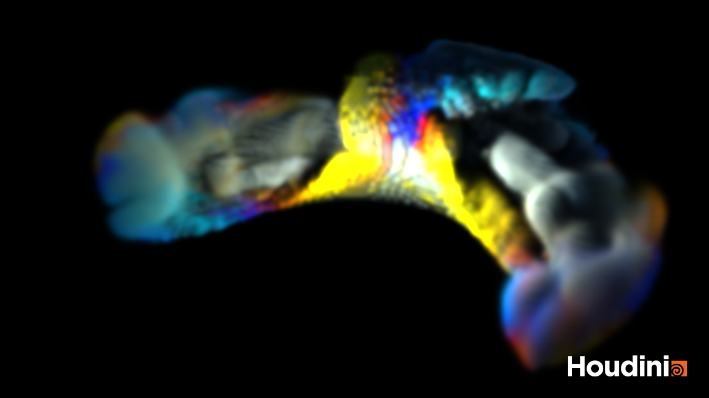
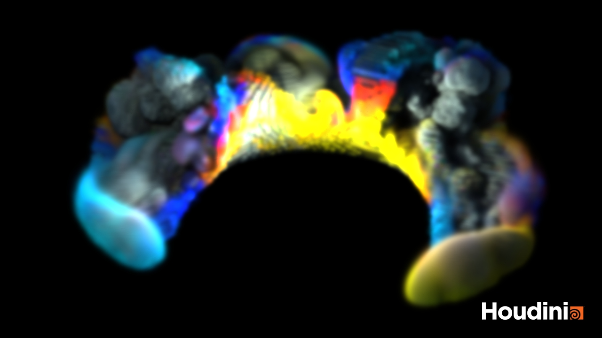
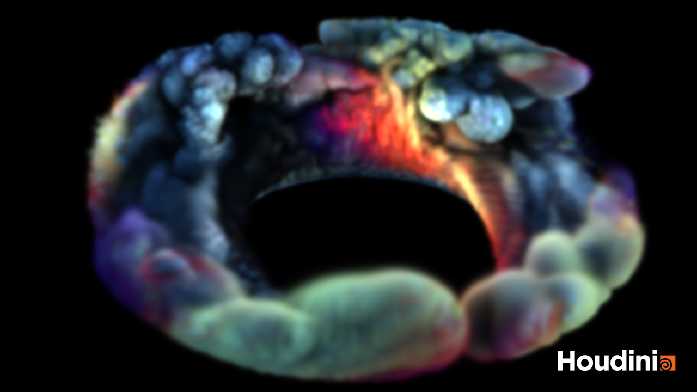
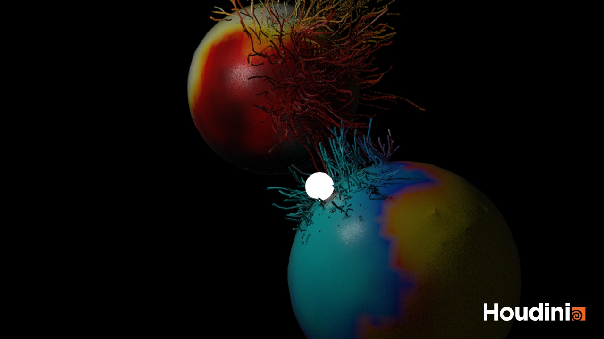
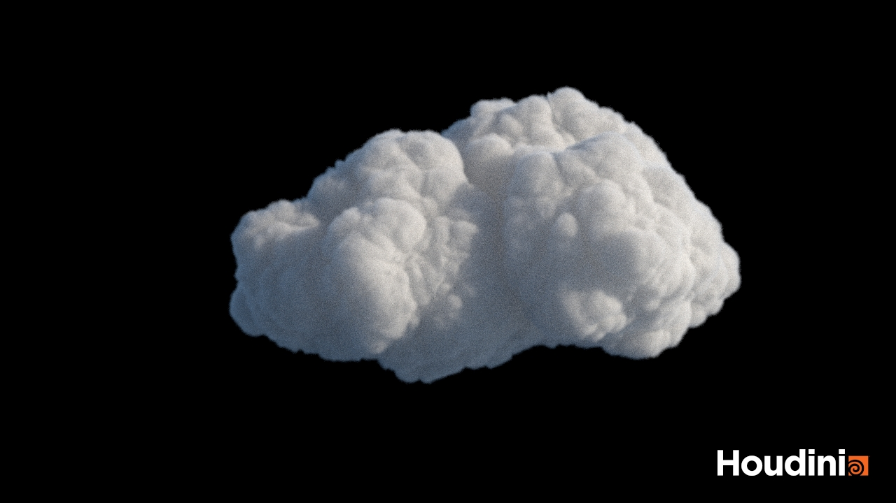
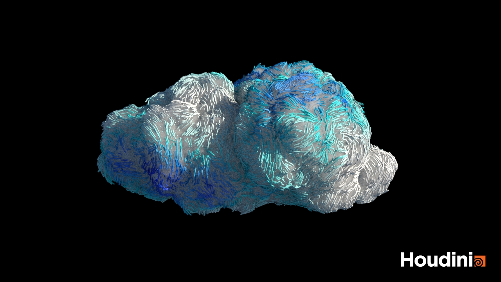
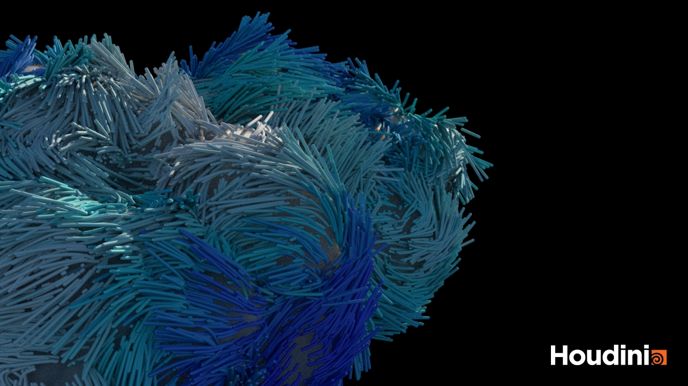
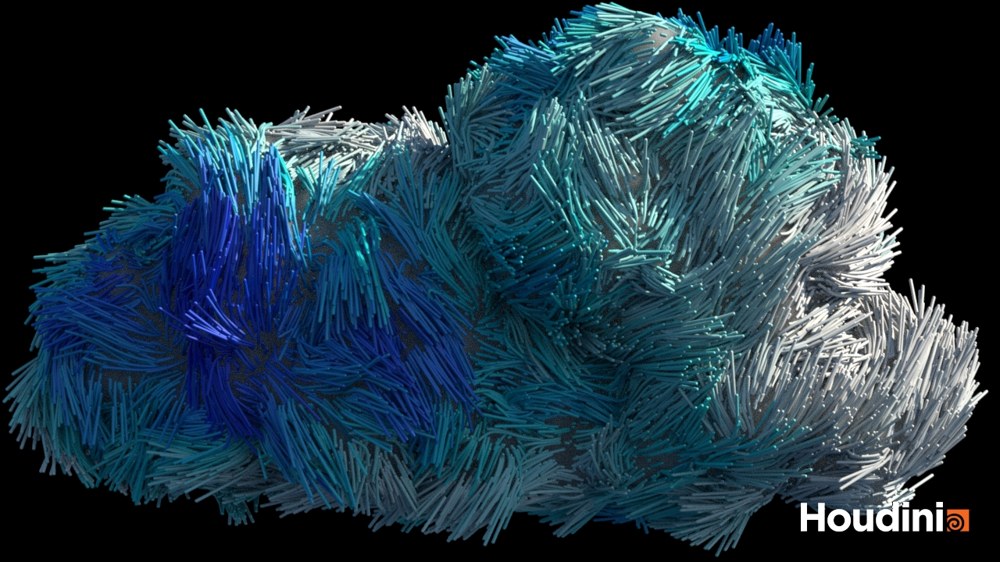

# Houdini Animation

Various animation I did in Houdini. Each folder contains Houdini source project and gallery.

## `Morph/`

Houdini 19.5.716 py3

View more on Artstation:
https://www.artstation.com/artwork/w0noNY

## `IsolineMovement/`

Houdini 19.5.716 py3

View more on Artstation:
https://www.artstation.com/artwork/qeweDe

## `TreeWind/`

Houdini 19.5.716 py3

View more on Artstation:
https://www.artstation.com/lovro

## `SpreadGrowth/`

Tech:
* Pyro spread
* VEX scaling, rotating
* GLTF instancing

Animation: https://www.artstation.com/artwork/Al89K5

Animation: https://www.artstation.com/artwork/XgZB2w

## `ColorfulSmoke/`

Houdini 19.5.716 py

Tech:
* Pyro volume simulation
* SOP emitter and geo collider with colors.

Animation: https://www.artstation.com/artwork/1xKLLL

## `GuidedGrowth/`

Houdini 20.0 py

Tech:
* RBD
* Geo distance + Attrib transfer
* POPs and trails

Animation: https://www.artstation.com/artwork/x3AP4E

## `CloudAbstraction/`

Houdini 20.05 pz

Tech:
* VDB cloud SOP
* Surface tangentfields
* Color adjust
* POPs with volume vector field advect
* Trails
* Solaris: staging, lighting and Karma XPU rendering

Artstation: https://www.artstation.com/artwork/5WBx9O

